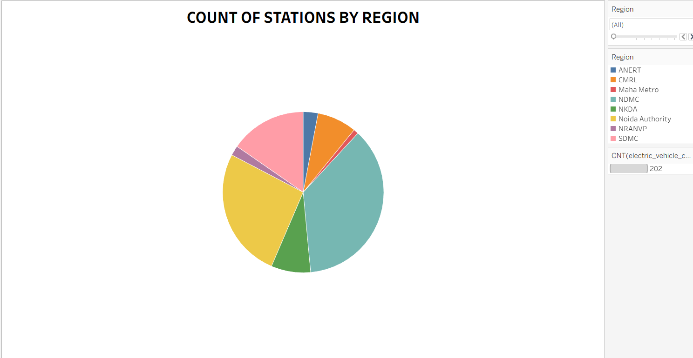

# Electric-Vehicle-Performance-Market-Analysis-

## Project Overview

This project analyzes electric vehicle performance and market trends using MySQL and Tableau.

The project focuses on uncovering key insights into electric vehicle performance by analyzing comprehensive datasets containing vehicle specifications, charging infrastructure, pricing, driving range, acceleration, top speed, efficiency, and body style. Through data preprocessing in MySQL and interactive visualizations in Tableau, the dashboard enables users to compare EV models, identify performance trends, evaluate charging infrastructure, and support data-driven decision-making for consumers, researchers, and business analyst

### Dashboard KPIs

-Total EV Models

-Average Top Speed (km/h)

-Average Driving Range (km)

-Average Fast Charging Speed (km/h)

### Visualizations
-Average Top Speed by Brand & Body Style

 

- Top 10 EV Models by Maximum Top Speed

  

- Acceleration Distribution by Body Style
  
  

- Electric Vehicle Price Comparison

  

- Average Driving Range by Brand

  

-Charging Stations by Region
  

## Tools Used

- Tableau Public
- GitHub

## Dataset

Combined Electric Vehicle Performance and Charging Infrastructure Datasets

## Dashboard Preview

## Use Links
- Github Repo: [GitHub Repository](https://github.com/Kotimarpina/Electric_Vehicle_Performance-and-Market_Analysis.git)
- Tableau Public Profile: [View Tableau Public Profile](https://public.tableau.com/app/profile/koti.marpina)
- Tableau Dashboard: [View Dashboard](https://public.tableau.com/app/profile/koti.marpina/viz/Final_Dashboard_17840403590320/ElectricalVehicleDashboard?publish=yes)
- Tableau Story: [View Story](https://public.tableau.com/app/profile/koti.marpina/viz/Final_DashboardStory/Story1?publish=yes)
- Demo Video:[View Video](https://drive.google.com/file/d/19gJaq68N7qaY1Ppd8yp1u0NLHe8BewtC/view?usp=drive_link)
## Author

- Koti Marpina

